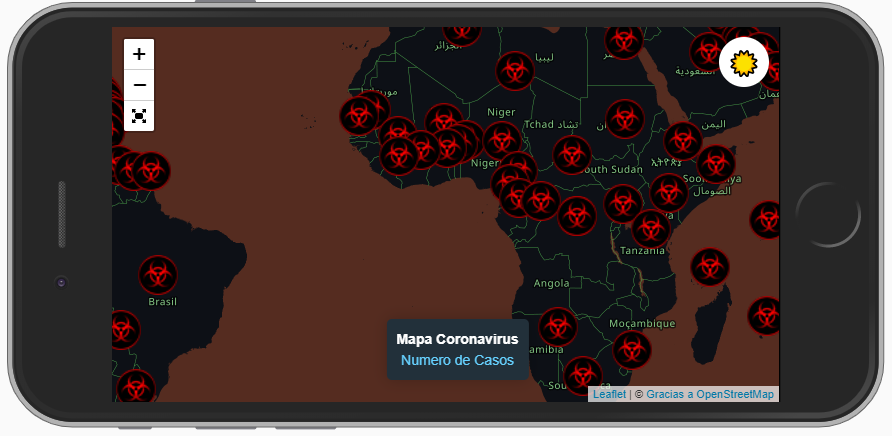
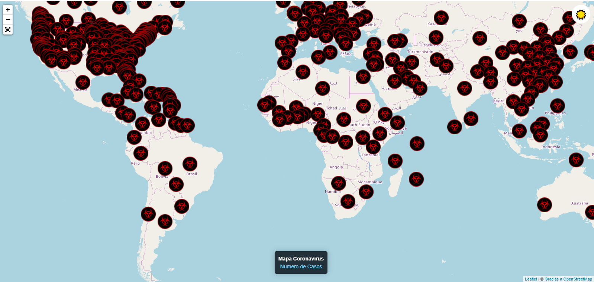

# Coronavirus 2019 Mapa

Ejercicio realizado para mostrar un mapa actualizado de las personas afectadas por el coronavirus a nivel mundial, usando herramientas como:
- Leaflet 
- Leaflet FullScreen
- Leaflet Edgebuffer

### Como Probarlo

Puedes verlo [aquí](https://corona-sm-2019-app.netlify.com) o seguir la guía sobre **Como Utilizarlo**

### ¿Como Utilizarlo?

Puedes bajarte el proyecto y ejecutarlo en un servidor web, si tienes NodeJS puedes instalar el paquete **live-server** y ejecutar el comando
```cmd
live-server
```

### Imágenes

**Versión Móvil**


**Versión Web**


**Versión Web**

### Inspiración
Este proyecto fue inspirando en un video genial que hizo el docente **Leonidas Esteban** y que me motivo a realizarlo con la librería Leaflet de manera gratuíta
- Pueden ver la clase original [aquí](https://www.youtube.com/watch?v=UlfacaW8634)
- Pueden revisar el API utilizado [aquí](https://github.com/Laeyoung/COVID-19-API)-> https://github.com/Laeyoung/COVID-19-API
<!--  -->

## Autor
> Stalin Maza - Desarrollador Web
- Puedes ver mi blog [aquí](https://stalinmaza97.hashnode.dev/)
- Puedes ver mi canal [aquí](https://www.youtube.com/channel/UCMDvFIXXZv5tUXNa7-qF5pw?view_as=subscriber)